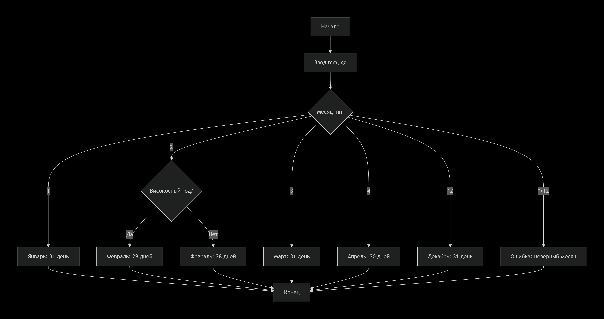
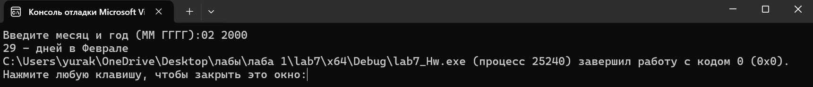

# Домашняя работа к лабораторной работе 5.
## Условия задачи:
Составить программу, которая в зависимости от порядкового номера
месяца выводит количество дней в этом месяце. Предусмотреть возможность
выбора года (високосный или не високосный).
## 1. Алгоритм и блок схема:
### Алгоритм:
1. **Начало**
2. Объявить переменные:
 	- `gg` — Входное число
	- `mm` — Входное число
3. Ввод переменных:
   - Ввод переменной: `gg`
   - Ввод переменной: `mm`
4. Выбор действия по значению `mm`:
   #### Если `mm` = 1:
   - Вывести "31 - день в Январе"
   - Завершить программу.
   #### Если `mm` = 2:
   - Если год делится на 4 И не делится на 100 ИЛИ год делится на 400:
     - Вывести "29 - дней в Феврале"
     - Завершить программу.
   - Иначе:
     - Вывести "28 - дней в Феврале"
     - Завершить программу.
   #### Если `mm` = 3:
   - Вывести "31 - дней в Марте"
   - Завершить программу.
   #### Если `mm` = 4:
   - Вывести "30 - дней в Апреле"
   - Завершить программу.
   #### Если `mm` = 5:
   - Вывести "31 - дней в Мае"
   - Завершить программу.
   #### Если `mm` = 6:
   - Вывести "30 - дней в Июнь"
   - Завершить программу.
   #### Если `mm` = 7:
   - Вывести "31 - дней в Июле"
   - Завершить программу.
   #### Если `mm` = 8:
   - Вывести "31 - дней в Августе"
   - Завершить программу.
   #### Если `mm` = 9:
   - Вывести "30 - дней в Сентябре"
   - Завершить программу.
   #### Если `mm` = 10:
   - Вывести "31 - дней в Октябре"
   - Завершить программу.
   #### Если `mm` = 11:
   - Вывести "30 - дней в Ноябре"
   - Завершить программу.
   #### Если `mm` = 12:
   - Вывести "31 - дней в Декабре"
   - Завершить программу.
   #### Иначе:
   - Вывести "ОШИБКА!"
5. **Конец**

### Блок схема

## 2. Реализация программы:
```
#define _CRT_SECURE_NO_DEPRECATE
#include <stdio.h>
#include <locale.h>

int main() {
	
	setlocale(LC_ALL, "");

	int gg, mm;
	
	printf("Введите день и месяц (ММ ГГГГ):");
	
	scanf("%d %d", &mm, &gg);
	
	switch (mm) {
	case 1: return printf("31 - день в Январе"); break;
	case 2:
		if (gg % 4 == 0 && gg % 100 != 0 || gg % 400 == 0) printf("29 - дней в Феврале"); 
		else printf("28 - дней в Феврале"); 
		break;
	case 3: return printf("31 - дней в Марте"); break;
	case 4: return printf("30 - дней в Апреле"); break;
	case 5: return printf("31 - дней в Мае"); break;
	case 6: return printf("30 - дней в Июнь"); break;
	case 7: return printf("31 - дней в Июле"); break;
	case 8: return printf("31 - дней в Августе"); break;
	case 9: return printf("30 - дней в Сентябре"); break;
	case 10: return printf("31 - дней в Октябре"); break;
	case 11: return printf("30 - дней в Ноябре"); break;
	case 12: return printf("31 - дней в Декабре"); break;
	default: printf("ОШИБКА!"); 
	}
	return 0;
}
```
## 3. Результат работы программы

## 4. Информация о разработчике
Капичников Юрий, бИПТ-252
